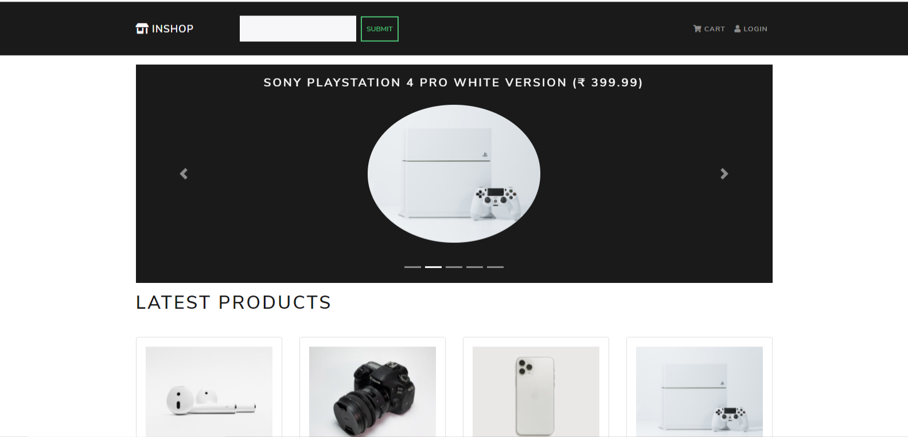

# InShop ecommerce website
> Inshop Ecommerce website using react and django


Hi! here iam created ecommerce website using react.js, django web framework and django restframework. In this project
i used django for a backend. Django restframework used to convert the backend to api format. In frontend i used react.js for
webpage design and redux for state management and user authentication i use jwt token authentication.

## Inshop Ecommerce


## Installation

Windows:

```sh
> For creating React app

npx create-react-app [Project Name]

> Here we are using Anaconda virtual enviranment

conda create -n env name python=version

conda activate env name

```


## Development setup

Describe how to install all development dependencies and virtual environment setup

dependencies for frontend:


```sh
   "dependencies": {
    "@testing-library/jest-dom": "^5.11.10",
    "@testing-library/react": "^11.2.6",
    "@testing-library/user-event": "^12.8.3",
    "axios": "^0.21.1",
    "create-react-class": "^15.7.0",
    "react": "^17.0.2",
    "react-bootstrap": "^1.5.2",
    "react-bootstrap-validation": "^0.1.11",
    "react-dom": "^17.0.2",
    "react-paypal-button-v2": "^2.6.3",
    "react-redux": "^7.2.4",
    "react-router-bootstrap": "^0.25.0",
    "react-router-dom": "^5.2.0",
    "react-scripts": "4.0.3",
    "redux": "^4.1.0",
    "redux-devtools-extension": "^2.13.9",
    "redux-thunk": "^2.3.0",
    "web-vitals": "^1.1.1"
  },
```
Requriements for Django:

```sh
    asgiref==3.3.4
    certifi==2020.12.5
    Django==3.1.4
    django-cors-headers==3.6.0
    djangorestframework==3.12.2
    djangorestframework-simplejwt==4.6.0
    Pillow==8.0.1
    PyJWT==2.0.1
    pytz==2021.1
    sqlparse==0.4.1
    typing-extensions==3.7.4.3
    wincertstore==0.2
```

Runtime version:

```sh
    Python 3.8.8
```

## Meta

BHARATHA KUMAR  – bharatha24kumar@gmail.com

Distributed under the MIT license. See ``LICENSE`` for more information.

[https://github.com/bharath2408/react-ecommerce-website](https://github.com/bharath2408/react-ecommerce-website)

## Contributing

1. Fork it (<https://github.com/bharath2480/react-ecommerce-website/fork>)
2. Create your feature branch (`git checkout -b feature/fooBar`)
3. Commit your changes (`git commit -am 'Add some fooBar'`)
4. Push to the branch (`git push origin feature/fooBar`)
5. Create a new Pull Request

<!-- Markdown link & img dfn's -->


